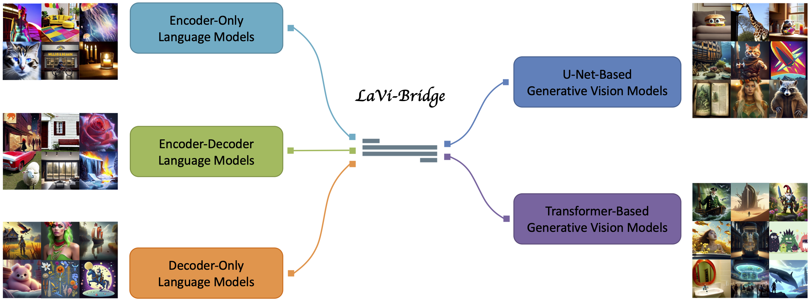
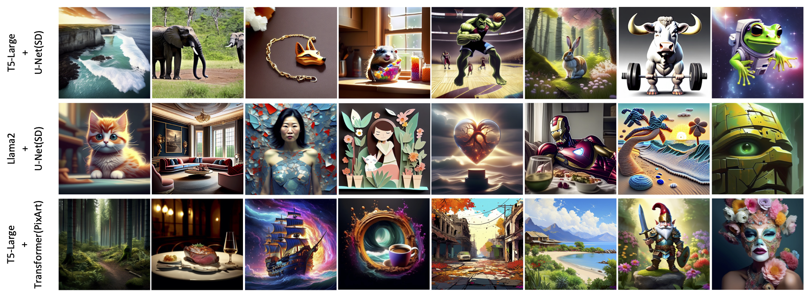

# Bridging Different Language Models and Generative Vision Models for Text-to-Image Generation

### [Project Page](https://shihaozhaozsh.github.io/LaVi-Bridge/) | [Paper (ArXiv)](https://arxiv.org/abs/2403.07860)

Official implementation of Bridging Different Language Models and Generative Vision Models for Text-to-Image Generation.



LaVi-Bridge is designed for text-to-image diffusion models and serves as a bridge, which enables the integration of diverse pre-trained language models and generative vision models for text-to-image generation. By leveraging LoRA and adapters, LaVi-Bridge offers a flexible and plug-and-play approach without requiring modifications to the original weights of the language and vision models. For more technical details, please refer to our [paper](https://arxiv.org/abs/2403.07860).


## ⚙ : Setup

You should create a new conda environment first by:

    conda env create -f environment.yaml
    conda activate lavi-bridge

You can download the pre-trained LoRA and adapters from the [link](https://huggingface.co/shihaozhao/LaVi-Bridge/tree/main). We provide weights for three different combinations: `T5-Large + U-Net(SD)`, `Llama-2 + U-Net(SD)` and `T5-Large + Transformer(PixArt)`.


## 💻 : Test

The inference scripts can be found in the `./test/` folder. To perform the inference, follow these steps:

    cd test
    bash run.sh
    
To run different combinations, you can modify the `.py`, `--ckpt_dir` and `--output_dir` to the corresponding one in `./test/run.sh`. `--ckpt_dir` refers to the directory where you have downloaded the LoRA and adapters, while `--output_dir` is the directory where the generated images will be saved. In the inference Python file, we have provided some prompts and you can change according to your needs.

It's important to note that for running `Llama-2 + U-Net(SD)`, you need to first download the pre-trained Llama-2 model from the [link](https://llama.meta.com/llama2/) (Llama-2-7b). Additionally, you should uncomment `--llama2_dir` argument in `./test/run.sh` and set it to the directory where you have downloaded the Llama-2 model.

Here are some visualization results:




## ☕️ : Training

To prepare the training data, the caption file should be organized in the following format, where each line contains the image path and its corresponding caption separated by a tab (\t):

    image_path1   caption1
    image_path2   caption2
    ...

For training, we recommend using both the [COCO2017](https://cocodataset.org/#home) and [JourneyDB](https://arxiv.org/abs/2307.00716) datasets. However, you can also use your own data.

The training scripts can be found in the `./train/` folder. To train the LaVi-Bridge, follow these steps:

    cd train
    bash run.sh

In `./train/run.sh`, make sure to set the `--anno_path` to the path of your caption file. `--output_dir` specifies the directory where you want to save the model weights. If you want to train the `Llama-2 + U-Net(SD)`, you need to download the pre-trained Llama-2 model and uncomment the `--llama2_dir` argument in the script.

If you want to train on CLIP text encoder, T5-Small, T5-Base, or U-Net(LDM), you can refer to `./train/t5_unet.py`. Simply change the corresponding model in the script, and it should work accordingly.


## 💡 : Others

Our paper is working on a promising field that has not been well-explored yet. We are delighted to have found another concurrent work on this topic. We welcome everyone to pay attention to it and contribute to the development of this direction together!

[ELLA: Equip Diffusion Models with LLM for Enhanced Semantic Alignment](https://github.com/ELLA-Diffusion/ELLA)


## 🎉 : Acknowledgments

This repo is built upon the [repository](https://github.com/cloneofsimo/lora) and really thank to their great work!


## 📖 : Citation

```bibtex
on the way
```
